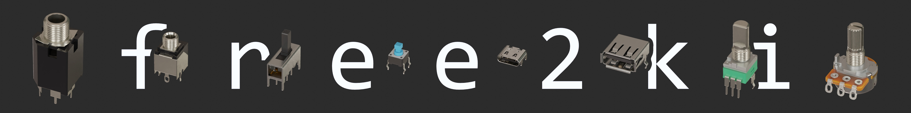

The free2ki [FreeCAD](https://github.com/FreeCAD/FreeCAD) workbench enables you to apply
materials to 3D models in FreeCAD, aswell as to easily export them to VRML (.wrl) files,
with correctly applied rotation and scaling, for use in KiCad aswell as Blender.

I created it as I wanted a fast to use, simple and less buggy/bloated alternative to the
[kicadStepUp](https://github.com/easyw/kicadStepUpMod) workbench, which also better
integrates into my KiCad to Blender workflow
([pcb2blender](https://github.com/30350n/pcb2blender)).

## Usage

1. Switch to the Free2Ki Workbench.
2. Select the models or parts of models you want to apply a material too.
3. Use the `Set Materials` tool, to setup the materials you want (this tool can be used
   multiple times to setup multiple materials, on a single object)
4. Export the selected objects (or the whole file if nothing is selected) via the `Export`
   tool. This will create a `<project_name>.wrl` file, in the same directory your FreeCAD
   project file is in.
5. (optional) Install the [pcb2blender] Blender addon and import your model via
   `File -> Import -> X3D (.x3d/.wrl)` (installing the `pcb2blender` addon is necessary,
   otherwise the `mat4cad` materials won't be recognized properly).

### Materials

Missing anything from the selection of available materials? Feel free to create an issue
on the [mat4cad](https://github.com/30350n/mat4cad) repository, explaining what materials
you'd like to see (possibly also how they'd look like in Blender) and I might add them in the
next update!

## Installation

- (not available yet) via the builtin addon manager
  `Tools -> Addon manager -> Workbenches -> free2ki`

- (manual) Download the [latest release](https://github.com/30350n/free2ki/releases/latest)
  and unpack the contents of the `free2ki.zip` into your
  [FreeCAD Mod folder](https://wiki.freecadweb.org/Installing_more_workbenches#Installing_for_a_single_user).

## Other Projects

- I've created all the 3D models of the
  [protorack-kicad](https://github.com/30350n/protorack-kicad) KiCad library, which contains
  all the custom symbols and footprints I use for eurorack module development, using this
  workbench.

- My [pcb2blender](https://github.com/30350n/pcb2blender) workflow makes use of the
  [mat4cad](https://github.com/30350n/mat4cad) materials that this workbench lets you apply
  to your models. These materials will be recognized by Blender and depending on the material
  type, different procedural textures/features will be used in Blender, making your models
  look more realistic.

## Credits

- The name of this project is inspired by the awesome
  [svg2shenzhen](https://github.com/badgeek/svg2shenzhen) Inkscape extension by
  [badgeek](https://github.com/badgeek).

## License

- This project is licensed under
  [GPLv3](https://github.com/30350n/free2ki/blob/master/LICENSE).
